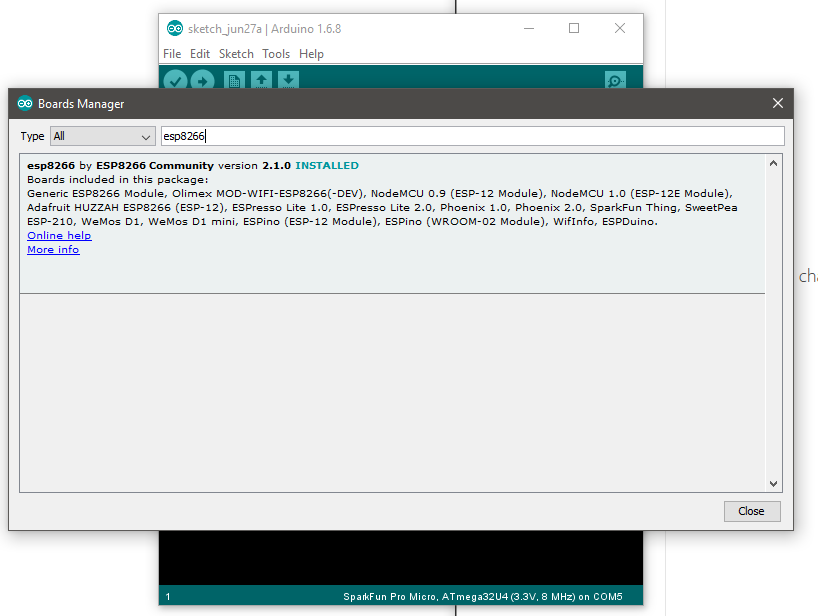
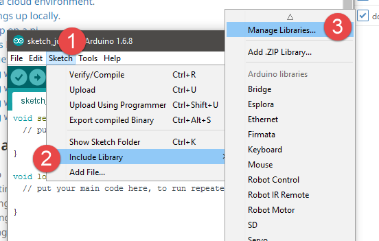
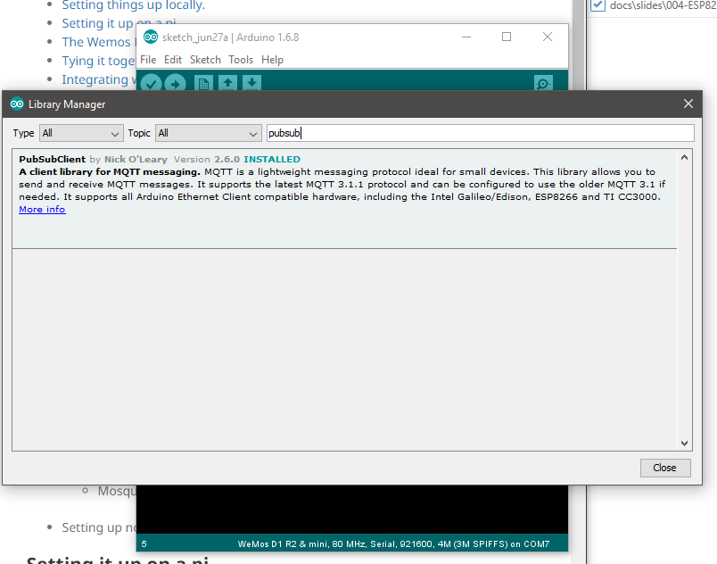
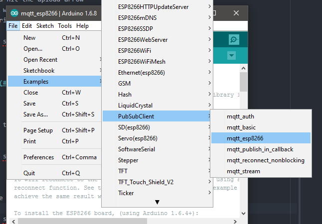
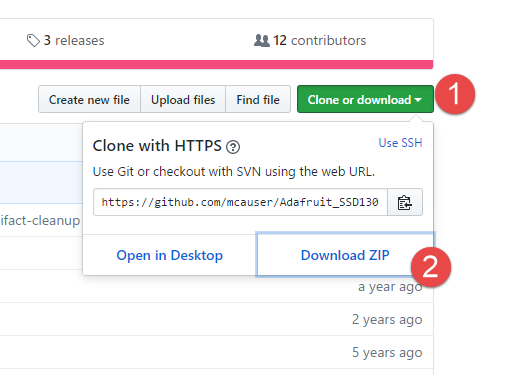
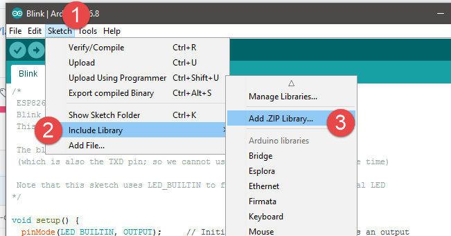

# The ESP8266 & The Wemos D1 Mini

+ [Setup](#setup)
  + Adding the board to the board manager
  + Settings
  + Pushing your first sketch - Blinking the LED
+ [MQTT on the ESP8266](#mqtt-on-the-esp8266)
+ Using the ESP with other things
  + [Pinout](#pinout)
  + [Button Shield](#button-shield)
  + [WS2812B RGB Shield](#ws2812b-rgb-shield)
  + [Motor Shield](#motor-shield)
  + [Ultrasonic Distance](#ultrasonic-distance)
  + [OLED](#oled)
  + [Analog Sensors](#analog-sensors)
    + Photo resistor (LDR)
    + IR Reflectance

---
class: middle, center

# Setup

---

+ If you haven't already, [download the Arduino IDE](https://www.arduino.cc/)

---

+ Under file, select preferences
+ under aditional boards, enter

`http://arduino.esp8266.com/stable/package_esp8266com_index.json`

+ and say OK

---

+ Under Tools select board and then Bard manager

---

+ Search for esp8266
+ and install it

---

+ While thats installing, lets go get the [USB Serial Bridge Drivers](https://wiki.wemos.cc/_media/file:ch341ser_win.zip)

<b> Do Not use the Mac driver on macOS Sierra </b>

<b>  Its unsigned and will cause kernel panic </b>

+ On mac, use [these](https://blog.sengotta.net/signed-mac-os-driver-for-winchiphead-ch340-serial-bridge/) drivers instead

+ if you fell into that trap, [here](https://tzapu.com/ch340-ch341-serial-adapters-macos-sierra/) is how to fix it

---

+ Lets send a super simple sketch just blinking the onboard LED to confirm it works
+ There are plenty examples, just open the blink sketch

---

+ Select the Comport your device is connected to

---

+ and hit the upload arrow
+ it will compile, and upload the code to the board
+ during the upload process the blue LED should flash rapidly

---

# MQTT on the ESP8266

---

+ In the Arduino IDE go Sketch, libraries and choose Manage libraries

---

+ The one we are looking for is called PubSubClient

---

+ Lets load the built in example for the esp8266

---

+ Change the wifi credentials and put in your MQTT Brokers IP (the elastic ip of your EC2 instance)
+ And open the serial monitor

---

+ Lets reconnect to our instance and see if the message is coming through

+ and that boys and girls is piped over the internets!

---

# Using the ESP8266 with other things

---

## Pinout

---

## OLED

---

+ The Adafruit library for the SDD1306 driver doesnt support our display size, but someone already edited it for us :)
+ download the repo [here](https://github.com/mcauser/Adafruit_SSD1306) as a zip

---

+ Add it to the IDE like so

---

+ You should now see the library under the (questionable) recomended libraries list.

---

+ Now under the examples we should see our LCD size as well

