# Setting up a cloud environment
+ [Creating an Ubuntu instance](#creating-an-ubuntu-instance)
  + Basic setup
  + Setting up port permissions
  + getting a static IP
  + sshing in
+ [Adding Mosquitto](#installing-an-mqtt-broker--mosquitto)
+ [Adding Node-Red](#setting-up-node-red)
  + Simple setup
  + Securing it (vital)

---
class: middle, center

# [](#creating-an-ubuntu-instance)Creating an Ubuntu instance

---

+ Log in to AWS Management console [here](https://console.aws.amazon.com/console/home)
+ and browse on over to the Elastic Cloud Compute service


---

+ open up the running instances page


---

+ Hit Launch instance


---

+ Select the Ubuntu Server
+ (Ubuntu Server 16.04 LTS (HVM), SSD Volume Type - ami-835b4efa as of writing)


---

+ Choose the t2.micro (its the only free one) and hit review and launch


---

+ Choose Edit security groups


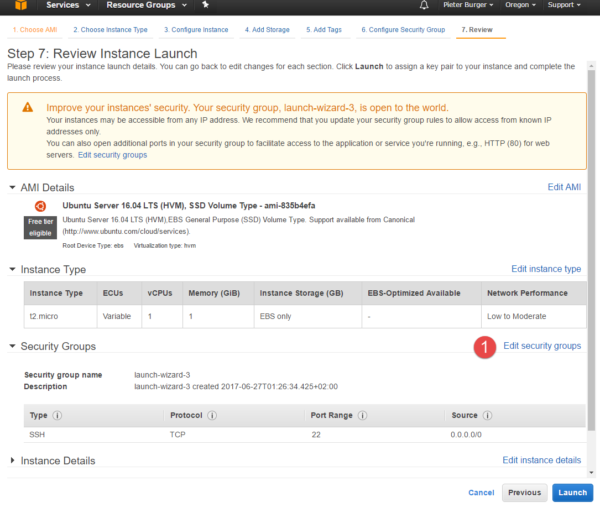


---

+ Set it up like so and hit launch
+ 1883 is for MQTT
+ 1880 is for node-red

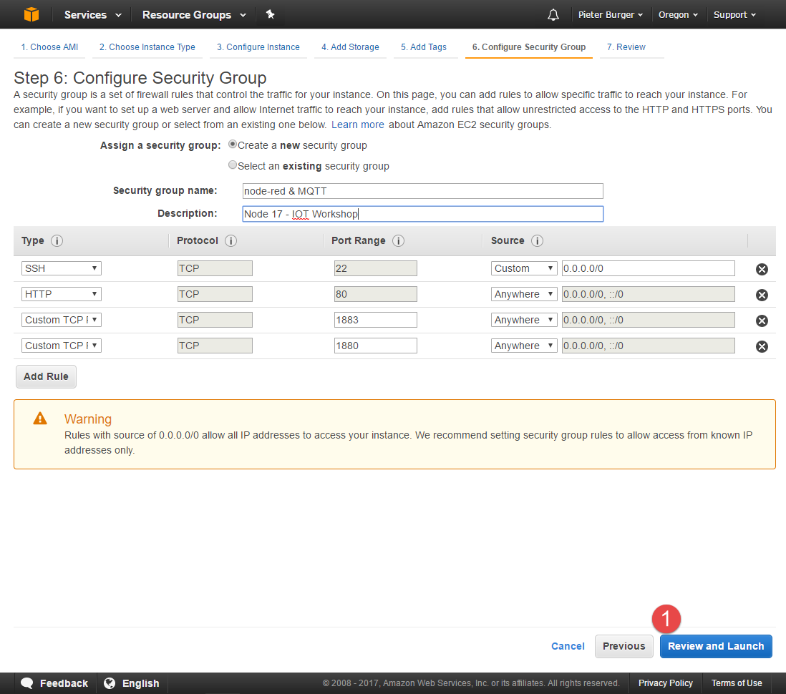


---

+ It will ask you to select or create a key pair
+ create one
+ download it
+ KEEP IT SAFE

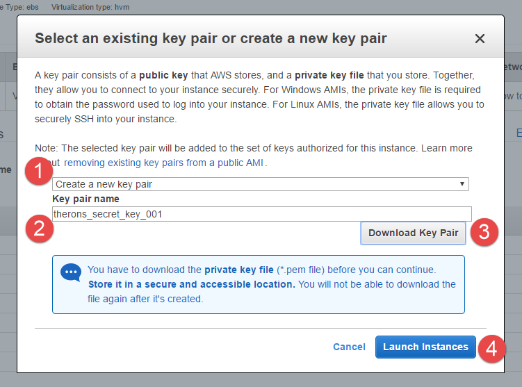


---

+ hit view

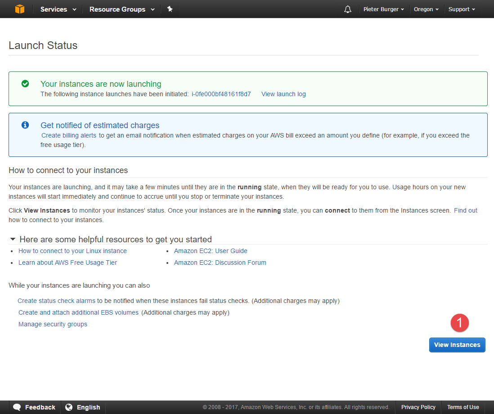


---

+ it will take a moment to initialize
+ while your waiting give it a name

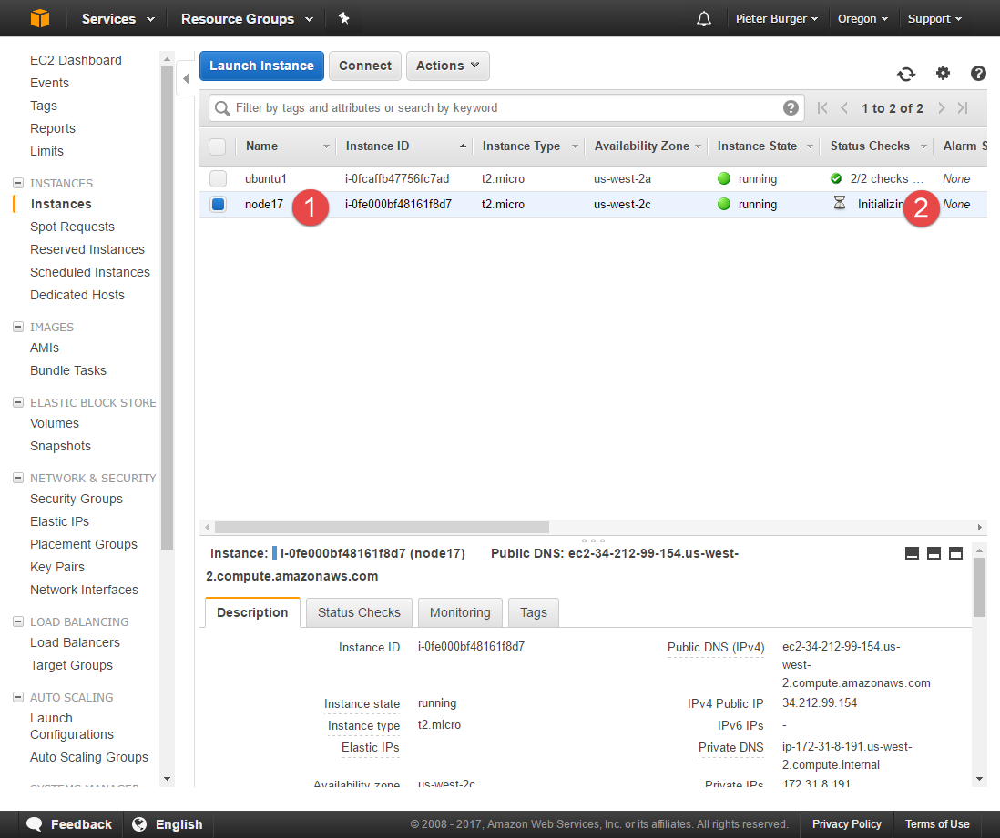


---


+ While its booting, lets go download a terminal if we havnt already got one.
+ Lets use [MobaXterm ](http://mobaxterm.mobatek.net/features.html)


---

+ Once its booted, go grab its public DNS


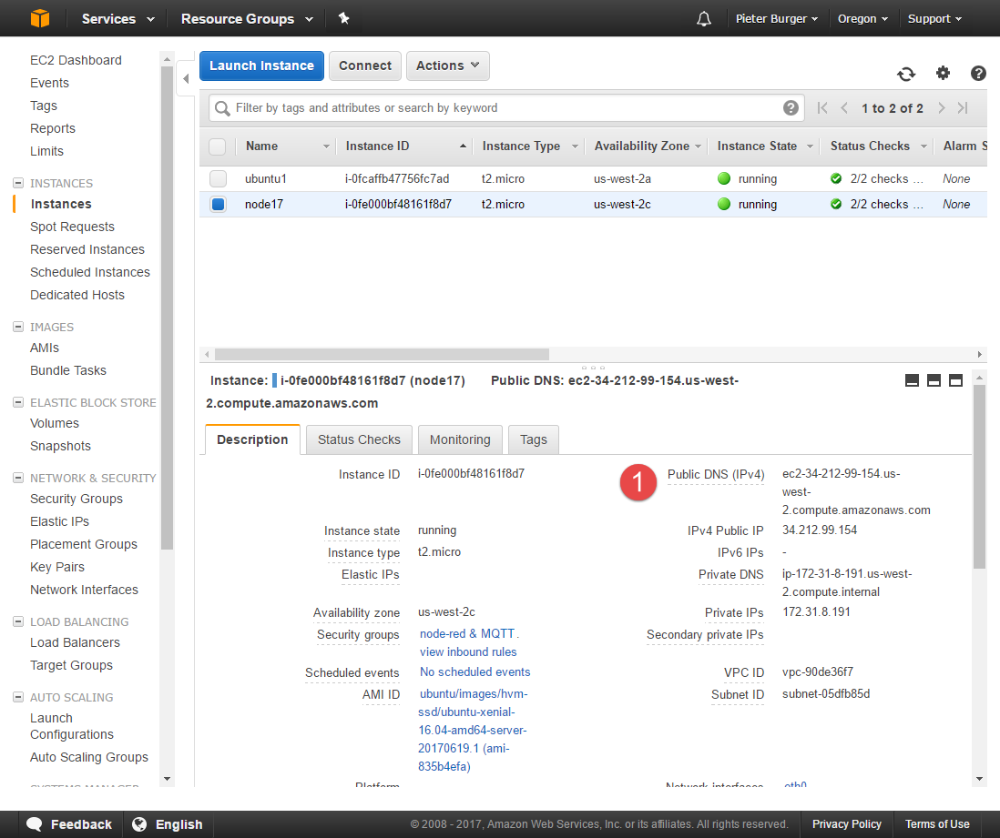

---

+ In MobaXterm, hit sessions

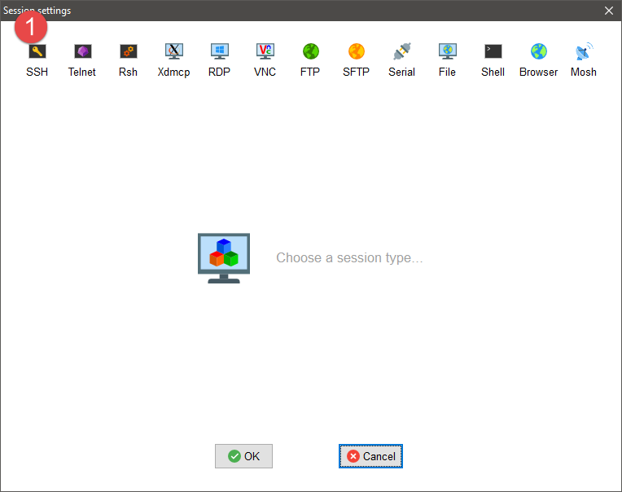


---

+ Select SSH
+ select your private key you downloaded earlier
+ enter the public DNS
+ and under username enter ubuntu
+ aaaaaaand hit ok


---

+ aaaaaand BAM your in
+ MobaXterm is nice because its got a handy little file browser, and we don't have to convert our keys like putty

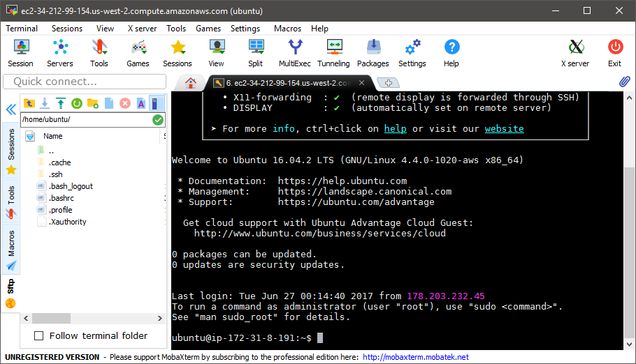

---

+ lastly, lets reserve an IP
+ Under network and security select Elastic IPs
+ click allocate


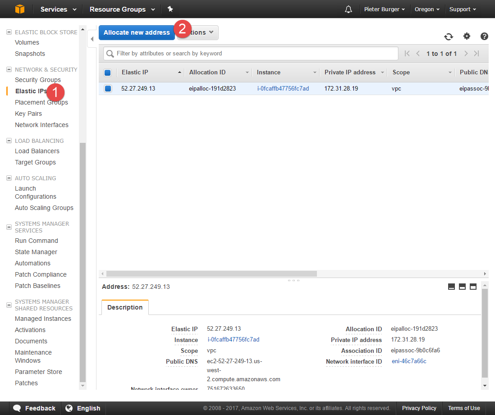

---

+ And again


---

+ And close

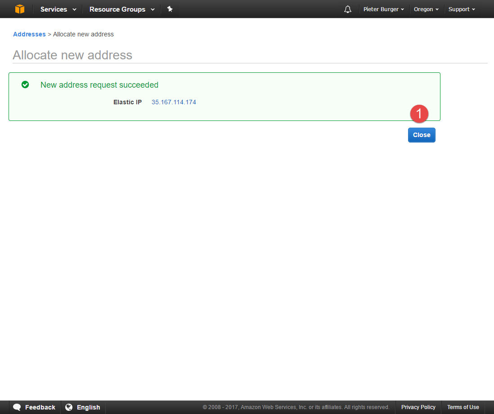

---

+ Now we have an address we can use, lets associate it with our instance


---

+ See that nice warning there?
+ Now youll need to SSH in using the IP you just allocated

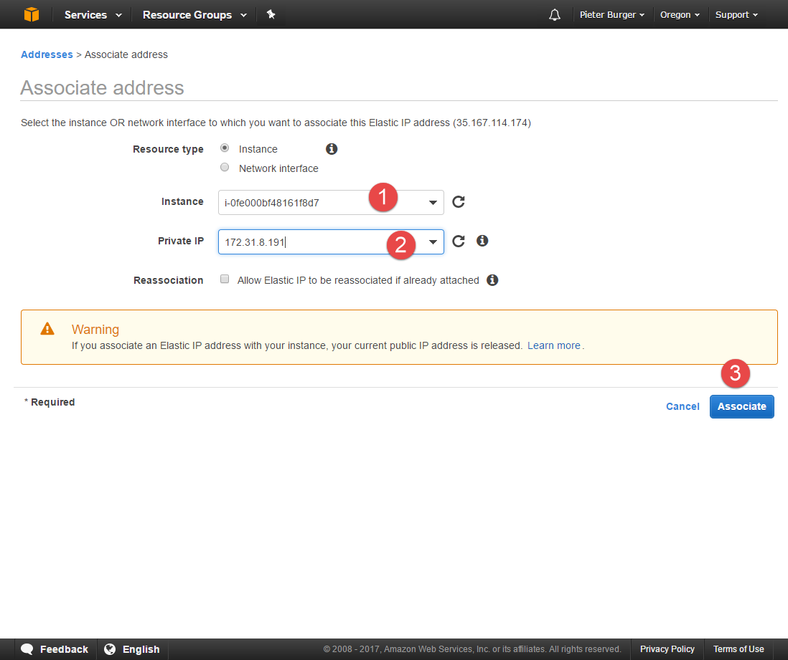

---

class: middle, center

# [](#installing-an-mqtt-broker--mosquitto)Installing an MQTT Broker : Mosquitto

---

in your shiny new instance, enter

`sudo apt-get install mosquitto mosquitto-clients`

It will ask you to confirm, enter Y and let it do its thing.

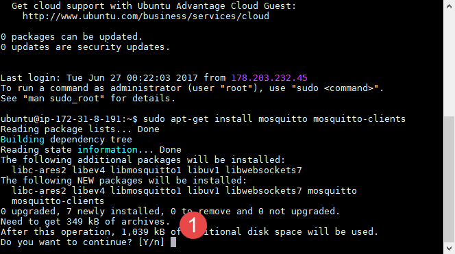

---

We can test it with `mosquitto_sub` and `mosquitto_pub`

open a second connection to the instance and in one subscribe to a topic like so

`mosquitto_sub -h localhost -t myNiceTopic`

and in the second, publish a message like so


`mosquitto_pub -h localhost -t myNiceTopic -m "Hi Mom"`

Try substituting the localhost for your public IP to test if thats working too

---


---


---

This isnt very secure.

Read up here on how to secure it better later

https://www.digitalocean.com/community/tutorials/how-to-install-and-secure-the-mosquitto-mqtt-messaging-broker-on-ubuntu-16-04

---
class: middle, center

# [](#setting-up-node-red)Setting up Node-Red

---

In your Ubuntu instance lets enter :

```text
curl -sL https://deb.nodesource.com/setup_4.x | sudo -E bash -
sudo apt-get install -y nodejs build-essential
sudo npm install -g node-red
```

---

OK, then we could get it to autostart as a service but lets use a magical servis called pm2 :

```text
sudo npm install -g pm2
pm2 start `which node-red` -- -v
pm2 save
pm2 startup
```

bonus points for connecting pm2 to [keymetrics](https://keymetrics.io/pm2/)

---

If that takes forever, you can always install it locally

download it [here](http://nodered.org/docs/getting-started/installation.html)

---

OK, so now you should be able to connect with your IP on port 1880


---

This is by far not secure, as its just open to the net.

Go check out how to secure it here :

https://nodered.org/docs/security
